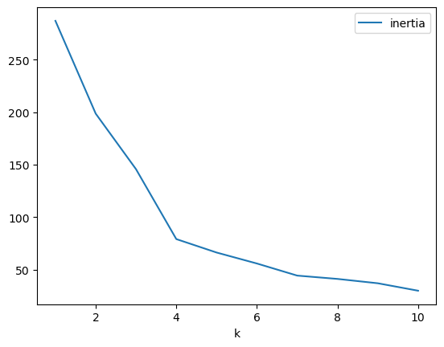
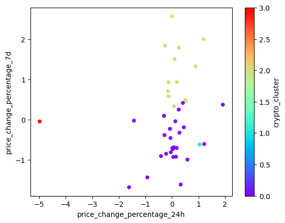
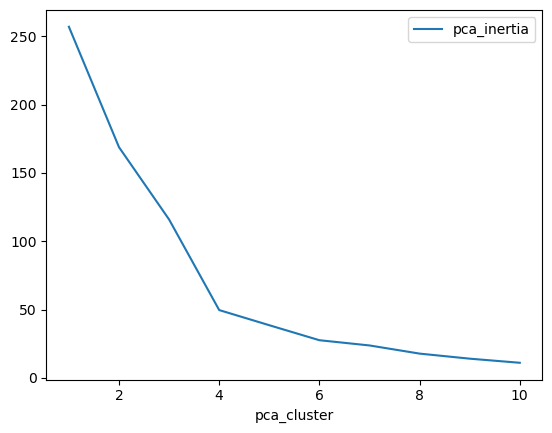

# 🧠 Cryptocurrency Clustering with K-Means and PCA

This project performs unsupervised learning on cryptocurrency market data to explore how similar coins behave based on price changes. It uses both **K-Means Clustering** and **Principal Component Analysis (PCA)** for dimensionality reduction and clustering optimization.

---

## 📥 Data Source

- Dataset: `Resources/crypto_market_data.csv`
- Each row represents a cryptocurrency.
- Columns represent price change percentages over various periods.

---

## 🔧 Libraries Used

```python
pandas, sklearn (KMeans, PCA, StandardScaler), matplotlib
```

---

## 🔄 Data Preprocessing

- Scaled features using `StandardScaler`.
- Preserved original coin identifiers via DataFrame index.

---

## 📈 Elbow Method to Find Best k (Original Data)

Used the elbow method to determine the optimal number of clusters (k) using **KMeans on scaled data**.



> **Best k = 4**

---

## 🔷 KMeans Clustering (Original Data)

Visualized clusters based on 24h and 7d price change percentages:



---

## 📉 Principal Component Analysis (PCA)

Reduced data to **3 principal components** capturing ~89.5% of the variance.

> **Explained Variance (PCA1–3):** ~89.5%

---

## 📊 Elbow Method to Find Best k (PCA Data)

Identified optimal k again after dimensionality reduction with PCA:



> **Best k = 4** — same as original data.

---

## 🌈 KMeans Clustering (PCA Data)

Visualized crypto clusters using PCA-reduced data:


---

## 📌 Feature Importance from PCA

Features with the strongest impact on each principal component:

- **PCA1**
  - Positive: `price_change_percentage_200d` (.5944)
  - Negative: `price_change_percentage_24h` (-0.4167)
- **PCA2**
  - Positive: `price_change_percentage_30d` (.5621)
  - Negative: `price_change_percentage_1y` (-0.1508)
- **PCA3**
  - Positive: `price_change_percentage_14d` (.3495)
  - Negative: `price_change_percentage_60d` (-0.3613)

---

## ✅ Conclusion

- Both **KMeans** and **PCA** suggest 4 distinct crypto behavior clusters.
- PCA effectively preserves data structure while reducing dimensions.
- Visual clustering helps interpret crypto groupings based on price volatility.

---

## 👤 Author

Josh Richardson  
[GitHub](https://github.com/jrich71) | [LinkedIn](https://www.linkedin.com/)

---

## 📄 License

MIT License – use freely for educational and analytical purposes.
