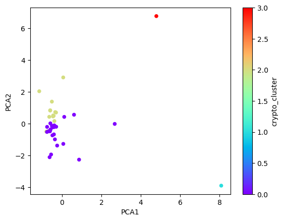

# Crypto Clustering (Module 11 Challenge)

## Background

The Module 11 challenge uses unsupervised machine learning methods to analyze a dataset of cryptocurrency performance over time. I leveraged Pandas and scikit-learn libraries for ingesting and preparing data, then segmenting cryptocurrencies by using K-means and principal components anaysis (PCA) approaches. The Module's end result was to identify the features with strongest (positive) and weakest (negative) influence on each component. In addition to identifying the strongest and weakest influences, I used ChatGPT-4o to interpret the results.

## Structure

The Module 11 assignment required work in the following areas:

- Preparing the Data
- Finding the Best Value for k Using the Original Scaled DataFrame
- Clustering Cryptocurrencies with K-Means Using the Original Scaled Data
- Optimizing Clusters with Principal Component Analysis
- Finding the Best Value for k Using the PCA Data
- Clustering Cryptocurrencies with K-Means Using the PCA Data
- Determining the Weights of Each Feature on Each Principal Component

## Libraries

I used the following libraries to carry out the work:

- pandas
- sklearn.cluster: KMeans
- sklearn.decomposition: PCA
- sklearn.preprocessing: StandardScaler

## Select Results

### Clustered Cryptocurrencies (K-means) of 24-hour vs 7-day Percentage Changes


### Clustered Cryptocurrencies (K-means) of PCA Data



## ChatGPT-4o Interpretation of Calculated Feature Weights from Principal Components Data

PCA1 (Main Driver: Long-Term vs. Short-Term Change)
* Strongest positive: price_change_percentage_200d (0.5944)
    * This suggests that PCA1 is strongly influenced by long-term price trends (200-day changes).
* Strongest negative: price_change_percentage_24h (-0.4167)
    * Short-term changes (24h) are negatively correlated with PCA1.
```
Interpretation: PCA1 likely represents a contrast between long-term and short-term price movements. Assets with high PCA1 scores are those with strong long-term growth but may experience lower or negative short-term changes.
```
PCA2 (Medium-Term Volatility vs. Stability)
* Strongest positive: price_change_percentage_30d (0.5621)
    * This suggests that PCA2 is mainly driven by medium-term (30-day) price changes.
* Strongest negative: price_change_percentage_1y (-0.1508)
    * The weaker negative value for 1-year change suggests that assets with strong 30-day changes may not necessarily have weak 1-year changes, but there is still some contrast.
```
Interpretation: PCA2 likely captures medium-term price volatility, with high PCA2 scores indicating assets that have seen significant movement in the past 30 days.
```
PCA3 (Short-Term Momentum vs. Medium-Term Change)
* Strongest positive: price_change_percentage_14d (0.3495)
    * This suggests that PCA3 captures price movement in the last 14 days.
* Strongest negative: price_change_percentage_60d (-0.3613)
    * A negative weight for the 60-day price change suggests that assets with high short-term gains (14d) may have underperformed over the last 60 days.
```
Interpretation: PCA3 represents a short-term momentum vs. medium-term trend contrast. A high PCA3 score means an asset has gained in the last 14 days but may have been weaker over the past 60 days.
```

#### Big Picture Takeaway:
* PCA1 differentiates assets based on long-term vs. short-term trends.
* PCA2 captures medium-term volatility.
* PCA3 shows recent short-term price momentum vs. longer (60-day) changes.